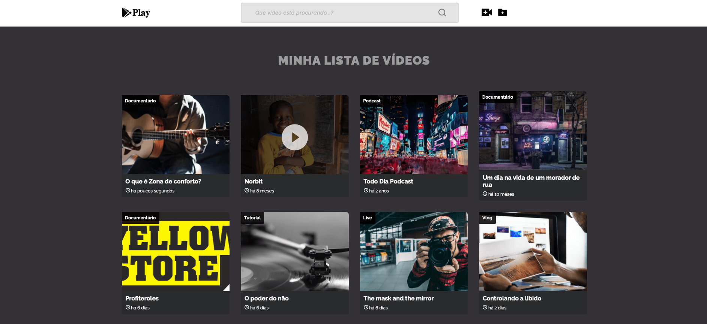
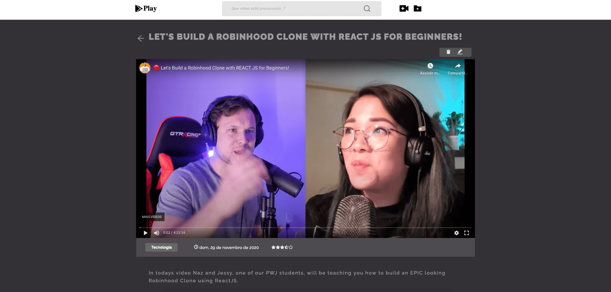
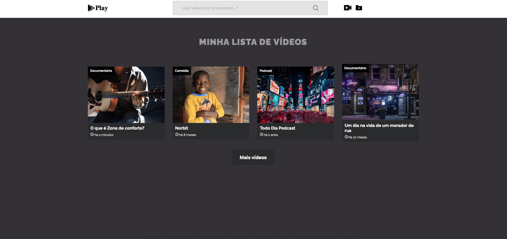
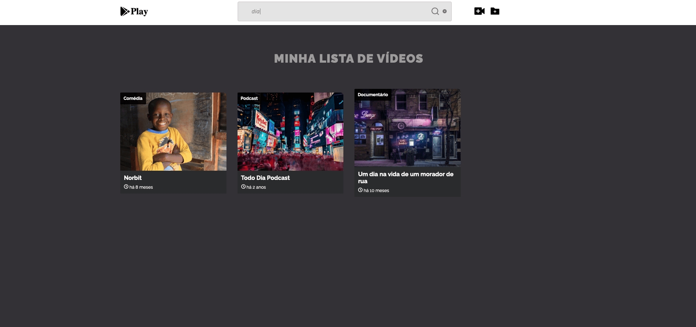
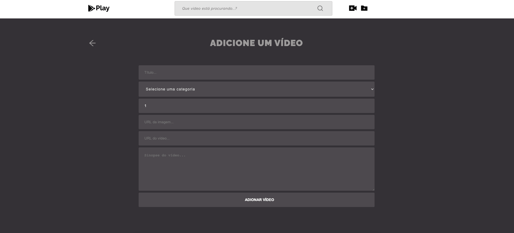
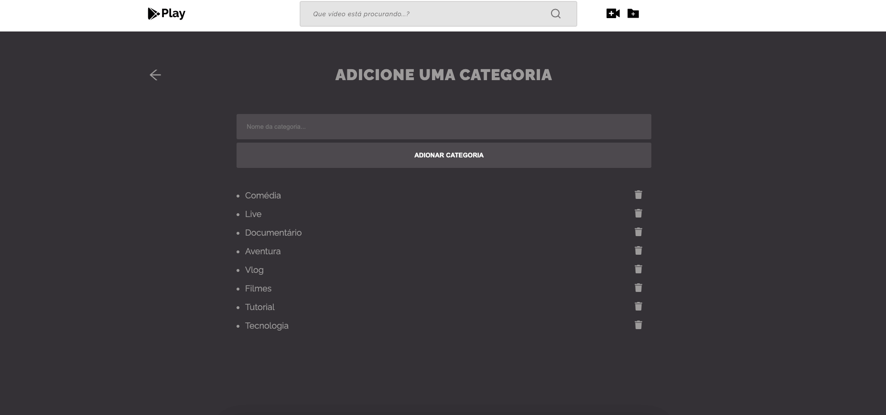
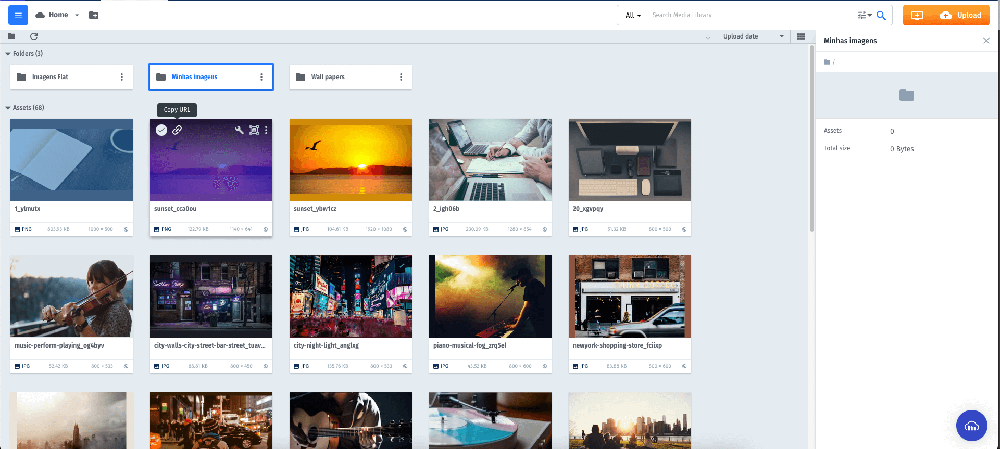

<h1>Video player com ReactJS, Hooks, Redux e Json Server</h1>
 
 
 

<h3>Tela de vídeos</h3>

 
 
<h3>Tela de reprodução do vídeo</h3>

 
 
<h3>Botão de carregar MAIS VÍDEOS</h3>

 
 
<h3>Filtrar vídeos</h3>

 
 
<h3>Adicionar vídeo</h3>

 
 
<h3>Adicionar categoria</h3>

 
 
 

<h3>É necessário adicionar imagem via cdn. O recomendado é criar conta no <a href="https://cloudinary.com/">Cloudinary</a></h3>
 

 
 
<h3>O que foi usado:</h3>
 
<li>Json Server como servidor backend</li>
<li>Pacote React  Player</li>
<li>React  Router Dom</li>
<li>Redux com React Hooks</li>
<li>Styled Components</li>
<li>React Moment com data/hora já em pt-br</li>
<li>React icons</li>
<li>Axios</li>
<li>Avaliação dinâmica com 5 estrelas</li>
 
 
 
<h3>Como usar e instalar:</h3>
<li>Instalação: rode o comando npm install ou yarn</li>
<li>Uso do client: npm start ou yarn start </li>
<li>API utilizada: https://v1deos.herokuapp.com/</li>
